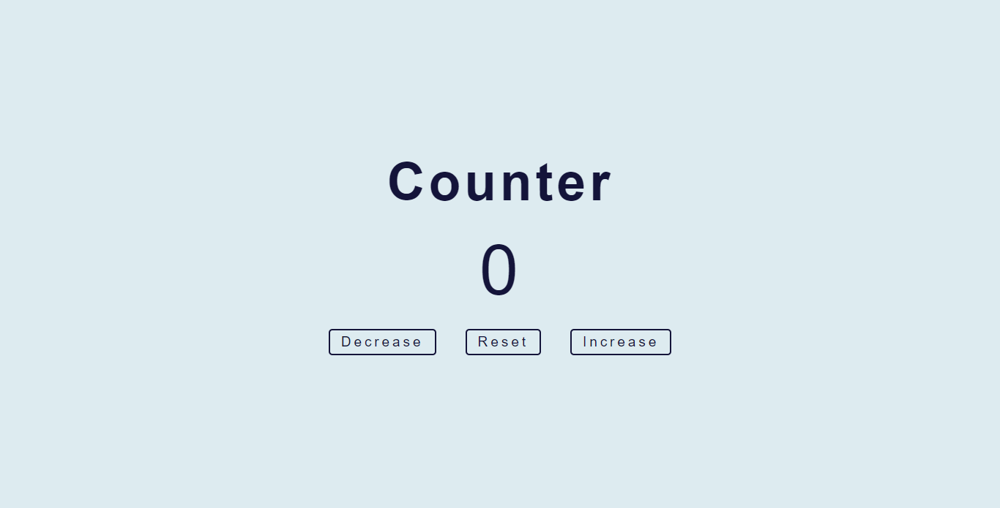
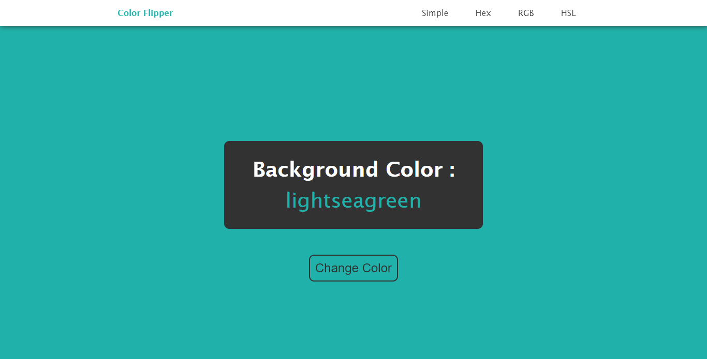
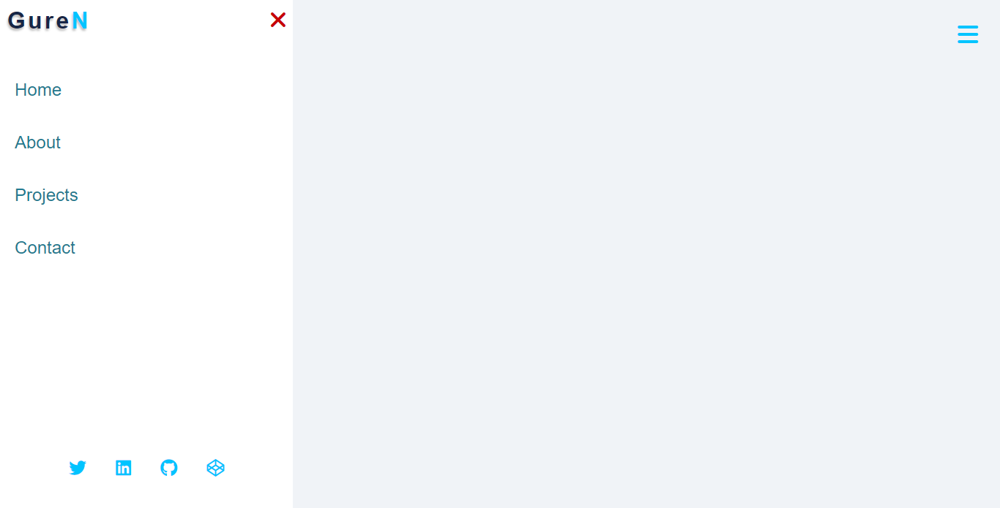
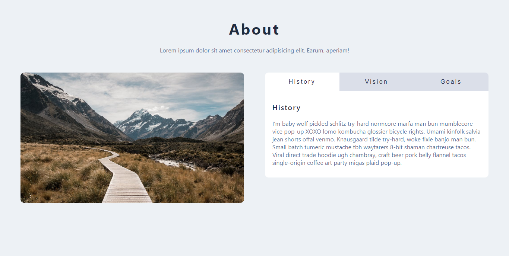
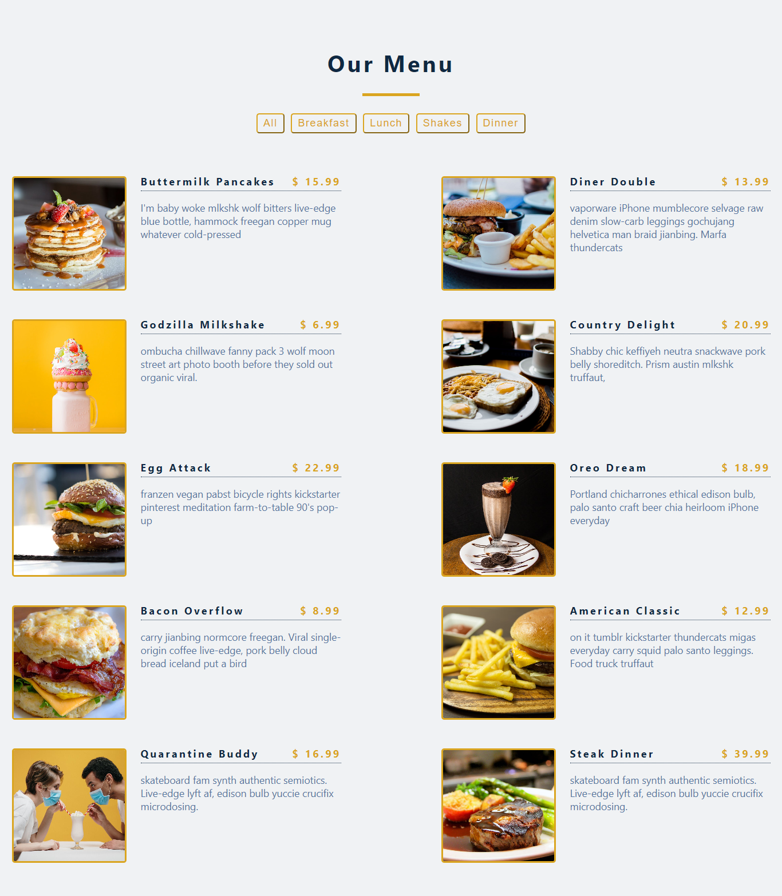
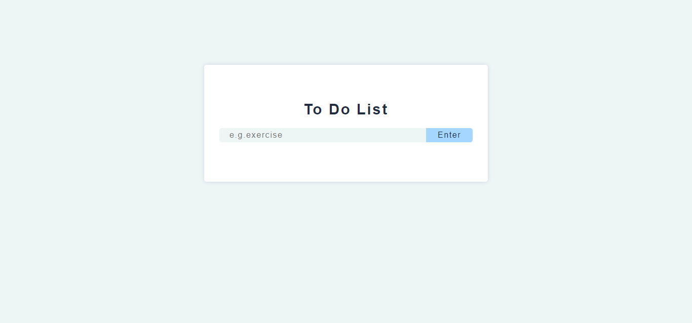

# Web Design & Javascript Projects

## Description

8 projects in web design and javascript, built in order to practice html, css and manipulating the DOM in vanilla javascript.
Project ideas are provided in [vanillajavascriptprojects](https://www.vanillajavascriptprojects.com/).

## Screenshots

1. Counter 
2. Color Flipper 
3. Animated Side Bar 
4. Tabs 
5. Menu Filter 
6. To-do Application 

## Aknowledgements

Thanks to [freecodecamp.com](https://www.freecodecamp.org/learn/2022/responsive-web-design/) and [w3schools.com](https://www.w3schools.com/js/) for their rich content in web design and javascript, and to [John Smilga](https://www.vanillajavascriptprojects.com/) for the great projects.
